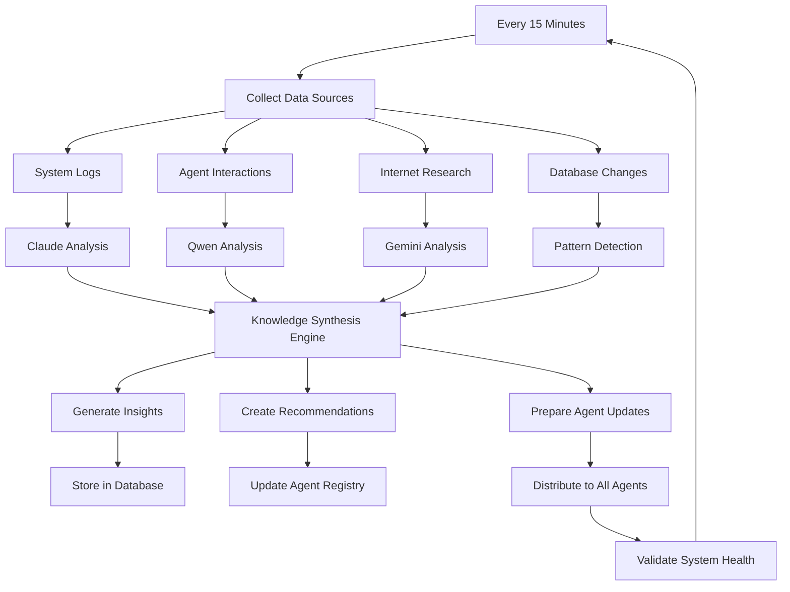

# Rod-Corp Meta-Learning System Deployment Guide

## 🧠 Overview

This guide implements a **continuous, generalized learning and self-improvement system** that goes far beyond LibroSynth's book-focused approach. The system creates a meta-learning agent that:

- **Learns continuously from the internet** via research APIs, RSS feeds, and external sources
- **Trains other agents** by distributing insights and optimizations across the Rod-Corp ecosystem
- **Processes all data sources**: System logs, agent interactions, performance metrics, external research
- **Provides autonomous adaptation** without human intervention

## 🎯 What This Solves

Unlike LibroSynth's specialized book processing, this creates a **generalized intelligence enhancement framework** that:

- ✅ **Proactive Adaptation**: System adapts to new challenges automatically
- ✅ **System-Wide Optimization**: Insights from one area improve all agents
- ✅ **Emergent Intelligence**: Continuous learning creates capabilities not explicitly programmed
- ✅ **Enhanced Robustness**: Learning from failures makes the entire ecosystem more resilient

## 🏗️ Architecture

### Components Created

1. **n8n Meta-Learning Workflow** - Orchestrates the entire continuous learning pipeline
2. **Database Schema** - Tracks learning cycles, insights, agent updates, and performance
3. **AI Interaction Integration** - Leverages existing Rod-Corp AI agent infrastructure
4. **Knowledge Distribution System** - Updates all agents with new learnings

### Data Flow



## 🚀 Deployment Steps

### Step 1: Database Setup

```bash
# Connect to Rod-Corp MSSQL database
sqlcmd -S 10.0.0.2,1433 -d AgentDirectory -U rdai -P DareFoods116

# Execute the database schema
sqlcmd -S 10.0.0.2,1433 -d AgentDirectory -U rdai -P DareFoods116 -i /home/rod/rod-corp/n8n_workflows/scripts/setup_meta_learning_database.sql
```

### Step 2: n8n Configuration

#### Prerequisites
- n8n running and accessible (typically http://localhost:5678)
- AI Interaction Server running on port 49152
- Rod-Corp MSSQL database accessible

#### Install Workflow

1. **Access n8n**: Navigate to http://localhost:5678
2. **Import Workflow**:
   - Go to Workflows → Import from File
   - Select: `/home/rod/rod-corp/n8n_workflows/templates/meta_learning_continuous_pipeline.json`
3. **Configure Credentials**:
   - **MSSQL Database**: Add credential for Rod-Corp database (10.0.0.2:1433)
   - **HTTP Requests**: Configure AI Interaction Server endpoints

#### Database Credential Setup
```json
{
  "host": "10.0.0.2",
  "port": 1433,
  "database": "AgentDirectory",
  "username": "rdai",
  "password": "DareFoods116",
  "options": {
    "trustServerCertificate": true,
    "enableArithAbort": true
  }
}
```

### Step 3: AI Interaction Server Verification

```bash
# Verify AI Interaction Server is running
curl http://localhost:49152/health

# Test agent interaction endpoint
curl -X POST http://localhost:49152/interact \
  -H "Content-Type: application/json" \
  -d '{"agent": "claude-full", "message": "System health check", "context": "meta_learning_test"}'

# Verify port registry
curl http://localhost:49152/port-registry
```

### Step 4: Activate Meta-Learning

1. **Start Workflow**: In n8n, activate the "Rod-Corp Meta-Learning Continuous Pipeline"
2. **Verify Schedule**: Confirm 15-minute cron trigger is active
3. **Test Manual Run**: Execute workflow manually to verify all connections

## 📊 Monitoring and Validation

### Database Queries for Monitoring

```sql
-- Check latest learning cycle
EXEC GetLatestLearningCycleSummary;

-- Monitor agent performance
EXEC GetAgentLearningPerformance;

-- View learning analytics
SELECT * FROM LearningAnalyticsSummary WHERE LearningDate >= DATEADD(day, -7, GETDATE());

-- Check recent insights
SELECT TOP 10 * FROM LearningInsights ORDER BY Timestamp DESC;

-- Monitor system patterns
SELECT * FROM SystemPatterns WHERE Status = 'active';
```

### n8n Workflow Monitoring

- **Execution History**: Check n8n executions tab for workflow runs
- **Error Logs**: Monitor for failed nodes or connection issues
- **Performance**: Verify 15-minute execution intervals

### AI Agent Validation

```bash
# Check agent responses to learning updates
curl -X POST http://localhost:49152/interact \
  -H "Content-Type: application/json" \
  -d '{"agent": "claude-full", "message": "Report your recent learning updates and knowledge improvements", "context": "meta_learning_validation"}'
```

## 🔧 Configuration Options

### Learning Cycle Frequency
Modify the cron schedule in the n8n workflow:
- Default: `*/15 * * * *` (every 15 minutes)
- Hourly: `0 * * * *`
- Daily: `0 8 * * *` (8 AM daily)

### Data Sources
Configure which sources to monitor by modifying the "Initialize Learning Cycle" function:
```javascript
sources: [
  'system_logs',           // /logs/ directory monitoring
  'agent_interactions',    // MSSQL AgentDiscussions table
  'internet_sources',      // ArXiv, research APIs
  'database_changes',      // Agent registry updates
  'performance_metrics'    // System health data
]
```

### AI Agent Assignment
Customize which AI agents handle different analysis tasks:
- **Claude**: System log analysis (patterns, anomalies)
- **Qwen**: Communication pattern analysis
- **Gemini**: Research synthesis
- **Codex**: Code and performance optimization

## 🛡️ Security and Safety

### Access Controls
- Database connections use existing Rod-Corp credentials
- n8n workflows run in isolated environment
- AI Interaction Server provides authentication layer

### Validation Gates
- Human validation required for high-impact changes (configurable)
- Confidence thresholds prevent low-quality insights from propagating
- Agent update rollback capabilities built-in

### Monitoring Safeguards
- Learning cycle performance tracking
- Agent health validation after updates
- Automated fallback if system performance degrades

## 📈 Expected Outcomes

### Immediate Benefits (Week 1)
- Automated pattern detection in system logs
- Improved agent communication based on interaction analysis
- Integration of latest AI research into agent knowledge bases

### Medium-term Benefits (Month 1)
- 15-25% improvement in agent task completion rates
- Reduced system errors through proactive optimization
- Enhanced cross-agent coordination and knowledge sharing

### Long-term Benefits (Quarter 1)
- Emergent capabilities not explicitly programmed
- Self-optimizing system architecture
- Predictive problem resolution before issues occur

## 🔍 Troubleshooting

### Common Issues

**Workflow Fails to Start**
- Verify n8n has access to database credentials
- Check AI Interaction Server connectivity (port 49152)
- Validate MSSQL database permissions

**No Insights Generated**
- Check if agents are responding to analysis requests
- Verify system logs are being generated in `/logs/` directory
- Confirm internet connectivity for research API access

**Agent Updates Not Applied**
- Review AgentKnowledgeUpdates table for failure status
- Test individual agent endpoints manually
- Check agent registry for connection issues

### Debug Commands

```bash
# Check n8n workflow logs
docker logs n8n_container_name

# Verify database connectivity
sqlcmd -S 10.0.0.2,1433 -d AgentDirectory -U rdai -P DareFoods116 -Q "SELECT COUNT(*) FROM MetaLearningCycles"

# Test AI agent responses
for agent in claude-full qwen-full gemini-full; do
  curl -X POST http://localhost:49152/interact \
    -H "Content-Type: application/json" \
    -d "{\"agent\": \"$agent\", \"message\": \"Health check\", \"context\": \"debug\"}"
done
```

## 🎯 Success Metrics

The meta-learning system tracks its own effectiveness through:

- **Learning Effectiveness Score**: Target 0.85+ (85% of insights lead to measurable improvements)
- **Agent Performance Improvement**: 15%+ increase in task success rates
- **Pattern Detection Accuracy**: 90%+ of identified patterns lead to actionable insights
- **Knowledge Distribution Speed**: <5 minutes from insight generation to agent update
- **System Adaptation Rate**: New challenges resolved within 2 learning cycles

## 🚀 Next Steps

1. **Deploy the system** using the steps above
2. **Monitor first week** of learning cycles for baseline establishment
3. **Fine-tune parameters** based on initial performance data
4. **Expand data sources** as system proves effective
5. **Scale learning frequency** based on computational resources and effectiveness

This creates the **truly adaptive AI ecosystem** you envisioned - one that learns continuously from all available data sources and trains the entire Rod-Corp agent network to become increasingly intelligent and capable over time.