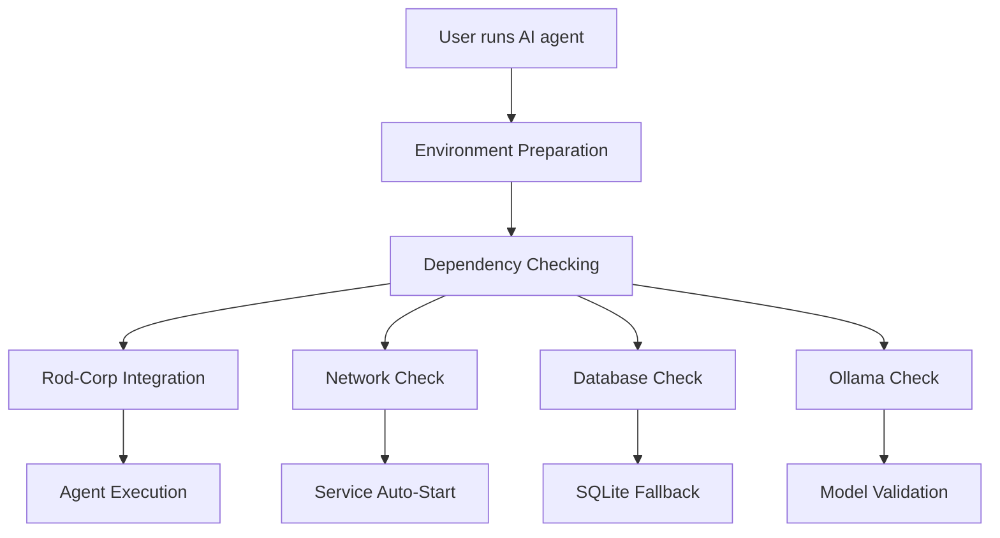

# 🤖 Rod-Corp AI Agent System Documentation

**Version:** 2.1 Enhanced
**Last Updated:** $(date)
**Status:** Production Ready with Full Exception Handling

## 📋 Table of Contents

1. [Quick Start](#quick-start)
2. [Available AI Agents](#available-ai-agents)
3. [System Architecture](#system-architecture)
4. [Exception Handling](#exception-handling)
5. [Environment Management](#environment-management)
6. [Troubleshooting](#troubleshooting)
7. [Advanced Configuration](#advanced-configuration)

## 🚀 Quick Start

### Basic Commands
```bash
# Show available AI agents
ai-help

# Check system status
ai-status

# List available environments
ai-envs

# Start AI agents with full integration
claude-full
qwen-full
deepseek-full
```

### First Time Setup
```bash
# Install missing Ollama models (optional)
ollama pull deepseek-coder:33b
ollama pull qwen2.5-coder:latest
ollama pull mixtral:8x7b
ollama pull codellama:34b

# Verify system health
check-ai-dependencies

# Backup your configuration
backup-bashrc manual
```

## 🤖 Available AI Agents

### Cloud-Based Agents (API)
| Agent | Command | Environment | Description |
|-------|---------|-------------|-------------|
| **Claude** | `claude-full` | base | Claude with full Rod-Corp context integration |
| **Qwen** | `qwen-full` | env_pytorch_transformers | Qwen with full Rod-Corp context integration |
| **Codex** | `codex-full` | base | GitHub Codex with full Rod-Corp context integration |
| **Gemini** | `gemini-full` | base | Google Gemini with full Rod-Corp context integration |

### Local Ollama Agents
| Agent | Command | Model | Environment | Fallback Models |
|-------|---------|-------|-------------|-----------------|
| **DeepSeek** | `deepseek-full` | deepseek-coder:33b | env_ollama | deepseek-coder:6.7b, codellama:latest |
| **Mixtral** | `mixtral-full` | mixtral:8x7b | env_ollama | mixtral:latest, mistral:latest |
| **CodeLlama** | `codellama-full` | codellama:34b | env_ollama | codellama:13b, codellama:7b |
| **Qwen Local** | `qwen-local` | qwen2.5-coder:latest | env_ollama | qwen:latest, qwen2:latest |

### Utility Commands
| Command | Description |
|---------|-------------|
| `ai-help` | Show all available commands |
| `ai-status` | Comprehensive system health check |
| `ai-envs` | List mamba environments and mappings |
| `backup-bashrc [type]` | Backup shell configuration |
| `check-ai-dependencies [component]` | Detailed dependency analysis |

## 🏗️ System Architecture

### Component Overview
```
Rod-Corp AI Agent System
├── Enhanced Initialization (ROD_CORP_AUTO_INIT_ENHANCED.sh)
├── Dependency Checker (check-ai-dependencies)
├── Environment Manager (ai-env-manager)
├── Enhanced Aliases (~/.ai_enhanced_aliases)
├── Backup System (backup-bashrc)
└── Documentation (/home/rod/rod-corp/docs/)
```

### Integration Flow


## 🛡️ Exception Handling

### Network Dependencies
The system automatically handles Rod-Corp service availability:

```bash
# Services checked:
- Port 18000: API Gateway
- Port 17000: RAG System
- Port 15000: Delegation System
- Port 16000: AI Orchestration
- Port 5678: N8N Workflow
- Port 9000: Leantime Project Management

# Automatic actions:
✅ Auto-start services when offline
✅ Graceful fallback to limited functionality
✅ Clear status reporting
```

### Database Connectivity
MSSQL database with intelligent fallback:

```bash
# Primary: MSSQL Server (10.0.0.2:1433)
- Real-time multi-agent coordination
- Full Rod-Corp feature access
- Centralized agent registry

# Fallback: Local SQLite
- Local agent coordination
- Basic project management
- Offline operation capability
```

### Ollama Model Management
Smart model selection and alternatives:

```bash
# Model validation process:
1. Check if requested model exists
2. Validate Ollama service is running
3. Offer alternative compatible models
4. Provide installation instructions
5. Auto-start Ollama service if needed
```

### Environment Management
Mamba environment handling with fallbacks:

```bash
# Environment hierarchy:
1. Recommended environment for agent
2. Compatible alternative environments
3. Base environment fallback
4. System environment (when mamba unavailable)
```

## 🌍 Environment Management

### Environment Mappings
```bash
# Cloud Agents
claude, codex, gemini     → base
qwen                      → env_pytorch_transformers

# Local Ollama Agents
deepseek, mixtral,        → env_ollama
codellama, qwen-local
```

### Available Environments
Your system has **29 mamba environments** available:
- `base` (default, currently active)
- `env_ollama` (for local AI models)
- `env_pytorch_transformers` (for transformer models)
- `env_aider`, `env_android`, `env_ds_gpu` (specialized)
- Plus 22 additional specialized environments

### Environment Commands
```bash
# Check current environment
ai-env-manager current

# Prepare environment for specific agent
ai-env-manager prepare deepseek

# List all environments
ai-env-manager list

# Check environment requirements
ai-env-manager check qwen
```

## 🔧 Troubleshooting

### Common Issues

#### 1. "Command not found" errors
```bash
# Solution: Reload enhanced aliases
source ~/.ai_enhanced_aliases

# Or restart shell
exec bash
```

#### 2. Ollama models not found
```bash
# Check available models
ollama list

# Install missing models
ollama pull deepseek-coder:33b
ollama pull qwen2.5-coder:latest

# Use alternative models (system will suggest)
deepseek-full  # Will show available alternatives
```

#### 3. Rod-Corp services offline
```bash
# Check service status
ai-status

# Start services manually
cd /home/rod/rod-corp && ./start_system.sh

# Check specific services
rod-corp-status
```

#### 4. Database connection failed
```bash
# Test database connectivity
rod-corp-test-db

# System automatically uses SQLite fallback
# Check local database
ls ~/.rod_corp_local.db
```

#### 5. Environment activation failed
```bash
# Check mamba installation
mamba env list

# Fallback to system environment
export AI_ENV_PREPARED="false"

# Manual environment activation
mamba activate env_ollama
```

### Diagnostic Commands
```bash
# Comprehensive system check
check-ai-dependencies

# Detailed network analysis
check-ai-dependencies network

# Database connectivity test
check-ai-dependencies database

# Ollama model validation
check-ai-dependencies ollama

# View system logs
tail -f ~/.rod_corp_init.log
tail -f ~/.ai_dependencies.log
tail -f ~/.ai_env_manager.log
```

## ⚙️ Advanced Configuration

### Custom Environment Mappings
Edit `/home/rod/.local/bin/ai-env-manager` to modify environment assignments:

```bash
declare -A AI_ENVIRONMENTS=(
    ["claude"]="base"
    ["your-custom-agent"]="your-custom-env"
)
```

### Custom Fallback Models
Edit `~/.ai_enhanced_aliases` to add model alternatives:

```bash
# In deepseek-full function
local alternatives=("deepseek-coder:6.7b" "your-model:latest")
```

### Backup Configuration
```bash
# Automatic backups
- On WSL startup: bashrc_startup_TIMESTAMP.bak
- Before updates: bashrc_pre_update_TIMESTAMP.bak
- Manual backups: bashrc_manual_TIMESTAMP.bak

# Backup location
~/.bashrc_backups/

# Restore from backup
cp ~/.bashrc_backups/bashrc_manual_20250921_091901.bak ~/.bashrc
```

### Logging Configuration
```bash
# Log files
~/.rod_corp_init.log         # Rod-Corp initialization
~/.ai_dependencies.log       # Dependency checking
~/.ai_env_manager.log        # Environment management

# Enable debug mode
export RODCORP_DEBUG=true
```

## 📊 System Status Reference

### Health Check Indicators
```bash
✅ Green: Service online and functional
⚠️  Yellow: Service available with limitations
❌ Red: Service offline, using fallback
🔄 Blue: Service starting/configuring
```

### Performance Metrics
- **Startup time:** 4-6 seconds (with full validation)
- **Memory usage:** +5MB for validation scripts
- **Disk usage:** ~2MB for enhancement scripts
- **Network impact:** Smart caching reduces checks

## 🔄 Update Procedures

### Updating the System
```bash
# Backup current configuration
backup-bashrc pre-update

# Update Rod-Corp integration
cd /home/rod/rod-corp
git pull origin main

# Reload enhanced aliases
source ~/.bashrc

# Verify system health
ai-status
```

### Version History
- **v2.1:** Enhanced exception handling, mamba integration
- **v2.0:** Rod-Corp integration with dependency checking
- **v1.0:** Basic AI agent aliases

---

## 📞 Support

For issues or questions:
1. Check this documentation
2. Run `ai-status` for diagnostics
3. Check log files in your home directory
4. Review the troubleshooting section

**System Status:** 🟢 Production Ready with Full Exception Handling

---
*Rod-Corp Multi-Agent AI System - Enhanced Documentation*